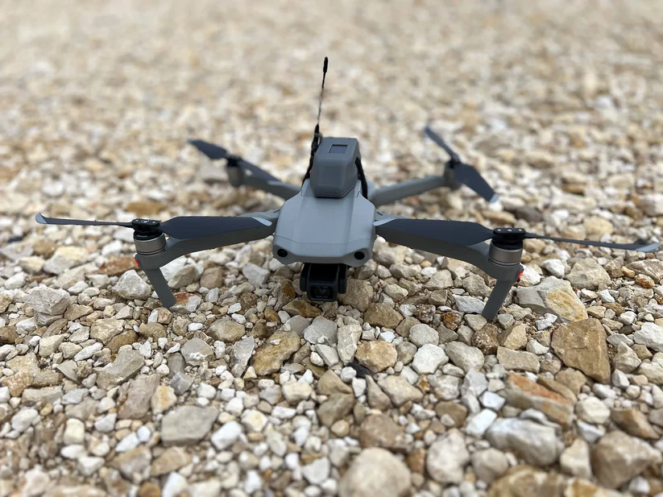
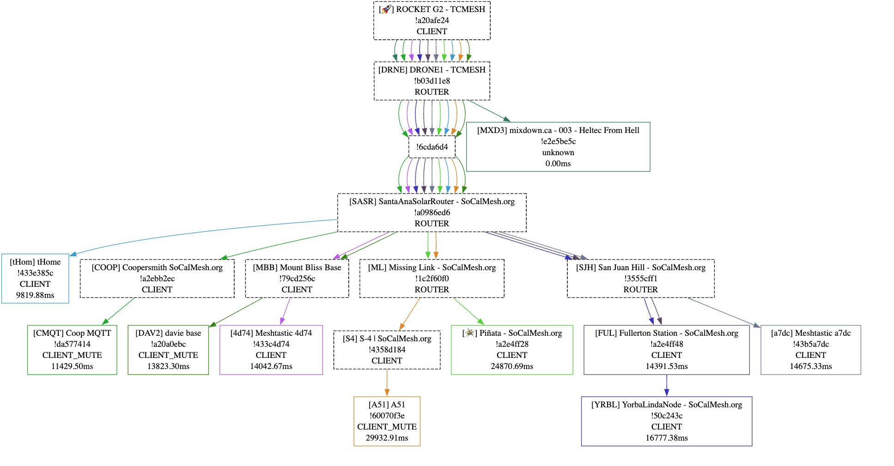

# 🚁 Boost Your Meshtastic Network Range in 60 Seconds with Spec5 Copilot Drone Node 🚁

## 🔥 Extend Your Network Range Fast!

With the **Spec5 Copilot Drone Node (HeltecV3)**, you can **expand your network range** effortlessly in under **60 seconds**. Simply launch the drone, and it will extend your node coverage, ensuring faster and more reliable connections.

## ⚡ Why Choose the Spec5 Copilot Drone?

- **Easy Setup**: Launch the drone and get started within a minute!
- **Range Extension**: Instantly boost the range of your network, providing wider coverage.
- **Reliable Connectivity**: With a robust system in place, your network stays strong even in tough conditions.

## 📸 Visualize the Power

### 💥 Check out how it works:

- Launch your drone to instantly increase network coverage.
- Use the **HeltecV3** technology for smooth operation and seamless connectivity.

## 🚀 Get Started

Ready to extend your range? Here’s how:

1. **Unbox the Spec5 Copilot Drone Node**.
2. **Set up the HeltecV3** on your drone.
3. **Launch and watch the magic happen!** In less than 60 seconds, your range will be extended, ensuring better coverage for your nodes.
