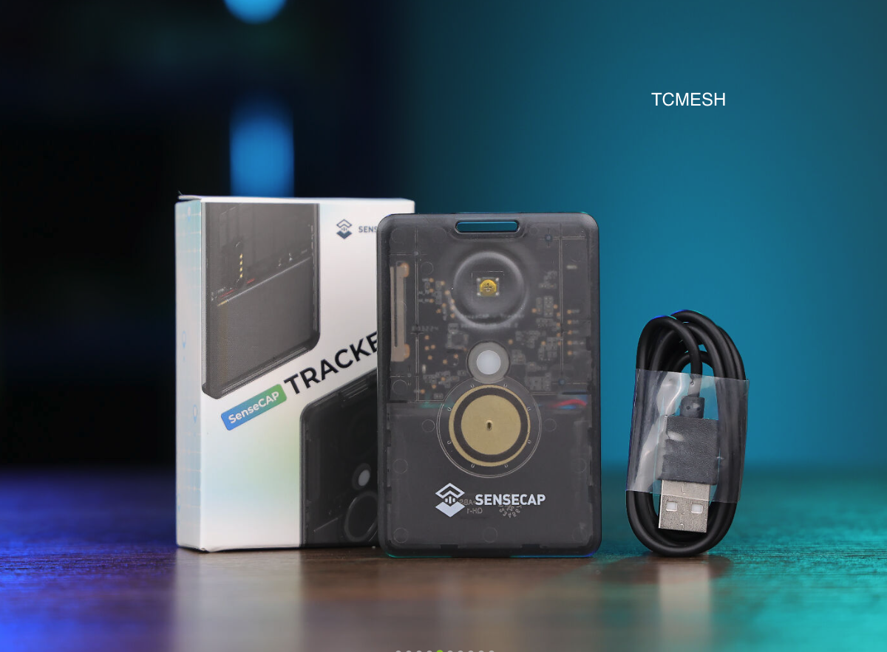
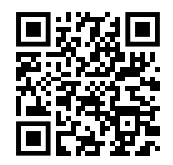

# TCMESH - Trabuco Canyon Mesh Network 🌄🛰️  

Welcome to **TCMESH**, a community-driven project to create a **peer-to-peer encrypted communication network** across **Trabuco Canyon, CA.** using **Meshtastic**. This network operates completely **off-grid**—with no internet or cell service required! 🌐  

### 🚨 **Our Mission**  

To **unite our community** with a **secure, alternate communication network** for **curiosity, connection, and emergency preparedness**.  
Stay connected during events like **fires**, **fallen poles**, and **flooding** 🌊🔥, without relying on **SCE power**, **internet**, **radio repeaters**, or **cell towers** ⚡📶.

---

### 📶 **How Meshtastic Works**  

Meshtastic (aka Lora Mesh Networking) is a long-range, open-source communication network designed to function without traditional cell towers or internet access. It is highly resilient and designed to avoid single points of failure. Here's how it works:

1. **Device-to-Device Communication**:  
   Meshtastic devices form a decentralized mesh network 🌐, where messages hop between devices to reach their destination 🚀, enabling communication over long distances, even in remote areas 🌄.

2. **Network Resilience**:  
   If a node goes offline ⚠️, the mesh automatically reroutes messages 🔄 through other available nodes, ensuring continuous operation without disruption 🔧.

3. **Unlicensed Usage**:  
   Meshtastic operates on the 915 MHz frequency in the unlicensed ISM band 📡, offering long-range communication without the need for a license 🚫.

4. **Power & Range**:  
   Devices can transmit up to 1 watt (30 dBm) ⚡ of power, providing extensive coverage 🌍, with the network’s relaying further extending its range 📶.

Example: Notice how Bobby can talk to Jack, even though they are blocked from direct line of sight. 
 

---

## ⚙️ **Quick Start**  

1. **Get a Device**: 👉 Starting at $40 and great for walking around the [SenseCap Tracker T1000-E](https://www.seeedstudio.com/SenseCAP-Card-Tracker-T1000-E-for-Meshtastic-p-5913.html) (direct link) or [SenseCap Tracker on Amazon](https://www.amazon.com/dp/B0DJ6KGXKB/) is an excellent mobile device.  [WisMesh Pocket V2 for $99](https://store.rakwireless.com/products/wismesh-pocket) is a very stable, turn-key, ready to go node for $99. You can also check out our TCMESH favorites on [Etsy](https://www.etsy.com/people/i9v8id6n/favorites/tcmesh-meshtastic-turn-key-devices) if you want a more custom device (be sure to avoid Heltec we've seen issues with the v3 production).
2. **Install the App:** [Download the Meshtastic app on iOS (App Store)](https://apps.apple.com/us/app/meshtastic/id1586432531) or [Android (Google Play)](https://play.google.com/store/apps/details?id=com.geeksville.mesh&pcampaignid=web_share). 📲  
3. **Connect Your Phone**: Use your **iPhone** or **Android** and select your new shiny Meshtastic device via **bluetooth**.
4. **Configure your device**: Go to meshtastic app, settings, user, and choose any shortname and long name you want.  For example mine is shortname: 🦅 long name: EAGLE - TCMESH. **Important** use TCMESH in your long name so we can include your anonymized location on our future TCMESH map.
5. **Join the Network**: Once connected, your device will automatically communicate with other nodes on the mesh.  Go to messages and chat in the primary channel or go to nodes and private message (**encrypted**) with any node in the network. 

📖 **For detailed instructions**, see our full guide: [INSTALLGUIDE.md](INSTALLGUIDE.md)  // Needs update

---

## 📍 **Coverage Map**  

### **Phase 1:** Establish Network 🎬
- **Live Oaks Grade** 🛣️
- **Hamilton Trail** 🏡  
- **Trabuco Oaks Drive** 🌲
- **Robinson Ranch** 🧑‍🌾

### **Phase 2:** Extend into additional areas of Trabuco Canyon 🌐  
- More coverage on Trabuco Oaks Drive, Live Oak Canyon Rd., Mountain View, Windy Ridge, Rosas Cantina 🌮
- Permanent node at the General Store
- **Holy Jim** 🔥 to the **Flying Field** 🛩️ with the **Cabins** 🛖 as a long term goal

### **Phase 3:** Connect surrounding canyons and communities 🏞️  
- Goal:  Find and promote stakeholders in other canyons that can extend the TCMESH to the following canyons:
- **Modjeska Canyon**, **Silverado Canyon**, **Williams Canyon**, **Black Star Canyon**

| 🟢   | 🟡   | ⚫   |
|------|------|------|
| Operational | Planned | Wanted |

View our [Extended Range Plan](EXTENDED-RANGE.md) and the [Future Goals of the Mesh](FUTURE-GOALS.md)

---

## 🤝 **We Need Your Help!**

We're looking for:

- **Nerds, hardware hackers, and radio enthusiasts** 🎙️ to help expand the network with hardware and code to improve network resiliency.
- **Volunteers** to place **routers** on their property 🏠 to enhance coverage. Ideal spots are at high elevations with good line-of-sight to neighboring areas and router nodes.
- **Advocates** to spread the word and recruit more community members.
- **Fundraisers** – Partner with a restaurant to share revenue with TCMESH. Our goal is to raise $1,000 to build the initial router network.
- **Community Leaders** to secure funding, collaborate with government agencies, and invest in turnkey nodes for optimal property placements. 

---

## ✅ **Current Progress**  
- **Our first solar powered node** will go live February 2025. 
- Successful tests have already occured from Hamilton Trail reaching as far as San Clemente and Anaheim.
- This website 😃

---

### 📅 **Join Our Weekly TC Mesh & SoCalMesh Net!**  

We're excited to invite all TC Mesh users to our **Weekly Net**! 🎉 This is a great opportunity for us to stay connected and ensure the network is operating smoothly.

🕕 **When:** Every Wednesday at **7:00 PM PT**  
📡 **Where:** Primary Channel 0 on Meshtastic in Trabuco Canyon, CA.

During the net, we will:  
1. **Trade Messages** 💬 – Test and communicate with others on the network.  
2. **Expose Coverage Issues** 📶 – Identify weak spots and areas that need improvement.  
3. **Teach & Learn** 🧑‍🏫 – Share knowledge with new users, answer questions, and provide demos.  
4. **Ensure Network Health** ⚙️ – Confirm that devices are functioning properly and the network is stable.
5. **Use Facebook Chat** 💬 - To relay mesh results in real time. 

Regular participation helps us keep TC Mesh reliable and ready for when we need it most.   Whether you're a beginner or an experienced user, your involvement makes a difference! 🤝  

See you every Tuesday at 6PM! Let's keep building and improving together! 🌐✨  

---

## 📡✨ Communications Compared 📊

| 📚 **PACE Level**   | 📡 **Method**           | 📝 **Description**                                                                             | ✅ **Pros**                           | ❌ **Cons**                           |
|----------------------|--------------------------|------------------------------------------------------------------------------------------------|----------------------------------------|----------------------------------------|
| **Primary**          | 📱 **Cell Phone / Internet** | Standard mobile networks or Wi-Fi internet communication.                                       | High reliability and speed             | Dependent on towers and infrastructure |
| **Alternate**        | 📶 **TCMESH (Meshtastic)**   | Encrypted peer-to-peer communication using mesh networking devices.                             | No infrastructure needed, encrypted    | Limited range, requires local nodes    |
| **Contingency**      | 🎙️ **GMRS**                  | General Mobile Radio Service (requires license), for family or local communication.              | Easy to use, better range than FRS     | Requires GMRS license, non-encrypted   |
| **Emergency**        | 📻 **Ham Radio**          | High-frequency amateur radio for long-range emergency communication.                            | Global range, robust in emergencies    | License needed, complex equipment      |
| **Emergency**        | 🛰️ **Satellite**             | Satellite communication (e.g., Starlink, Iridium) for critical off-grid communication.           | Global coverage, reliable in remote areas | Expensive, limited message capacity  |

---
## **FAQ - Frequently Asked Questions**

**Do I need a license or technical knowledge?** - No license needed and the sensecap works out of the box.   

**What is RSSI and SNR mean?** - Meshtastic devices provide two key metrics to evaluate signal quality: **RSSI (Received Signal Strength Indicator)** and **SNR (Signal-to-Noise Ratio)**.  

In wireless communication, **RSSI** and **SNR** determine signal quality.

#### **RSSI** (Signal Strength)  
- Measures how strong the signal is (like how loud someone is speaking).  
  - **Good:** Above **-115 dBm**  
  - **Poor:** Below **-126 dBm**  
- **Analogy:** In a concert, voices can be loud (**RSSI = -80 dBm**) but still hard to hear due to noise.

#### **SNR** (Signal Clarity)  
- Measures how much louder the signal is compared to background noise.  
  - **Good:** Above **17.5 dB**  
  - **Poor:** Below **9 dB**  
- **Analogy:** In a quiet cafe, soft voices (**RSSI = -115 dBm**) are easy to understand because the noise is minimal (**SNR = 25 dB**).

Both strong **RSSI** and high **SNR** are needed for reliable communication.

| **Metric**   | **Good**                     | **Fair**                       | **Bad**                       | **Poor**                   |
|--------------|-------------------------------|---------------------------------|-------------------------------|----------------------------|
| **RSSI**     | 🟢 > -115 dBm                 | 🟡 -115 dBm to -120 dBm         | 🟠 -120 dBm to -126 dBm        | 🔴 ≤ -126 dBm              |
| **SNR**      | 🟢 > 17.5 dB                  | 🟡 11 dB to 17.5 dB             | 🟠 9 dB to 11 dB               | 🔴 < 9 dB                  |

---
### 📜 **TCMESH Community Messaging Policy**  

To ensure a positive, inclusive, and respectful environment for all users, the following guidelines apply to messaging over TC Mesh:  

1. 🚫 **No Politics or Religion**:  
   Keep conversations neutral and avoid topics related to politics or religion to maintain harmony.  

2. 🗣️ **No Foul Language**:  
   Use respectful language at all times. Offensive or inappropriate language is strictly prohibited.  

3. 🚷 **No SHAFT Content**:  
   Content related to **Sex, Hate, Alcohol, Firearms, or Tobacco/Drugs** is not allowed. Keep messages clean and safe for everyone.  

4. 👶 **All-Age Appropriate**:  
   All messages should be suitable for audiences of all ages. Think family-friendly in all communications.  

5. 📵 **No Commercial Sales or Spam**:  
   Messages promoting commercial sales, advertisements, or spam are not permitted. Let's keep the network free of unwanted promotions.

6. 🪪 **Legal Placement of Routers & Nodes**:
   Place routers in areas with federal, state, city, goverment, property owner permission.  It's good practice to keep e-mail permission in your files. Avoid "rougue" installations to maintain **TCMESH** as a leading mesh network with good relationships to keep network placement safe.

Together, we can maintain a respectful, safe, and enjoyable space on **TCMESH**! 🤝🌐  

---
| Links 📎 | | |
|--------------------|-------------------|------------------|
| [BEST PRACTICES](BEST-PRACTICES.md) 📑 | [DRONE](DRONE.md) 🚁 | [EXTENDED RANGE](EXTENDED-RANGE.md) 🌍 |
| [FUTURE GOALS](FUTURE-GOALS.md) 🌱 | [INSTALL GUIDE](INSTALLGUIDE.md) ⚙️ | [LICENSE](LICENSE) 📜 |
| [README](README.md) 📘 | [SOLAR BUILD](SOLAR-BUILD.md) ☀️ | |

---
## 📢 **Spread the Word!**

### 📱 **Join the TCMESH Community!**
Have your friend scan this code to access this TCMESH page! 🤝

### 💬 **Join the Conversation!**
Want to connect with fellow community members? 💬

[Join our TCMESH Facebook Chat](https://m.me/ch/AbZCRRHT38CXy0zt/) (For the Canyon Areas)

[Join SoCalMesh Discord](https://discord.gg/BWAqfNzN) (Southern California Area)

[Join the Official Meshtastic Discord](https://discord.gg/meshtastic-867578229534359593) (Global)

---
### ⚠️ Disclaimer ⚠️ 

TCMESH, its members, and nodes make no guarantees regarding the reliability of communication within the network. TCMESH does not manufacture, sell, warranty, or place any equipment; the responsibility for equipment installation lies solely with the participant. While TCMESH strives to provide a stable off-grid communication system, it operates on a best-effort basis and may experience disruptions. By participating, you acknowledge that TCMESH is not liable for any failed communications. You are solely responsible for ensuring your use of TCMESH complies with all applicable local, state, and federal laws, including those related to telecommunications, radio frequencies, and data privacy. TCMESH does not collect personal data unless explicitly stated, but participants should be aware that while mesh networking may encrypt communications, the exit node could potentially decrypt and store data. Personal identifiable information should never be disclosed over the network. TCMESH encourages users to conduct their own research and use the network at their own risk. Participants agree to indemnify TCMESH, its members, contributors, and affiliates from any claims, damages, or liabilities arising from the use or misuse of the network. All trademarks are the property of their respective owners.
