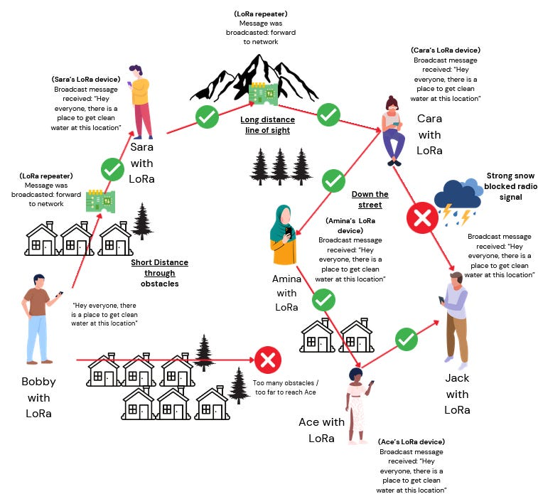
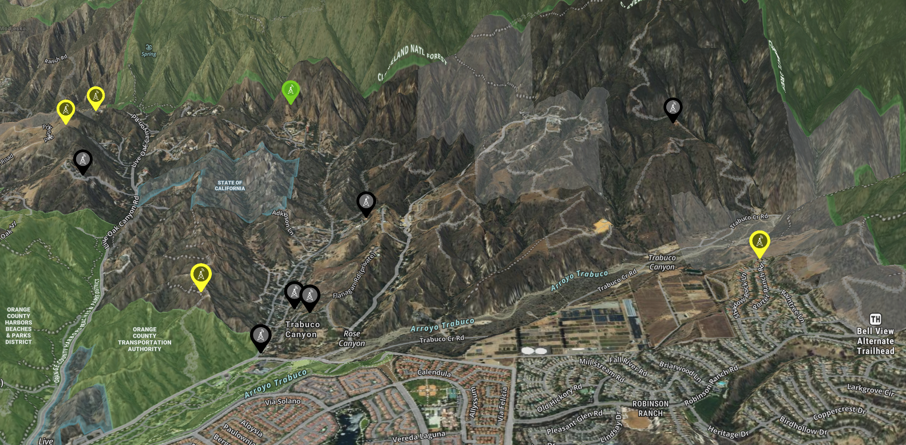

# Inter-Canyon Mesh Text Message Network 🌄🛰️  

Welcome to **ICMESH**, a community-driven project to create a **peer-to-peer encrypted communication network** across **our canyons** using **Meshtastic**. This network operates completely **off-grid**—with no internet or cell service required! 🌐  

---

### 📡 **How Does It Work?**  
We’ve placed several repeaters 📶 across the canyons, starting in Trabuco Canyon, to provide radio frequency coverage 🌍 over our rugged terrain. Using Meshtastic, an open-source mesh networking system 🌐, all you need is a small radio 📻 paired to your phone via Bluetooth 📲 to get up and running in minutes ⏱️—here’s an example of how it works: Bobby can text Jack 💬 across the network, with messages hopping from device to device 🚀, bypassing obstacles and working without internet, power, or cell service 🚫 

---

## ⚙️ **Quick Start**  

1. **Get a Device**: 👉 Starting at $40 and great for walking around the [SenseCap Tracker T1000-E](https://www.seeedstudio.com/SenseCAP-Card-Tracker-T1000-E-for-Meshtastic-p-5913.html) (direct link) or [SenseCap Tracker on Amazon](https://www.amazon.com/dp/B0DJ6KGXKB/) is an excellent mobile device.  Note:  If Amazon is out of stock the price may show higher and in that case use the direct-link. The [WisMesh Pocket V2 for $99](https://store.rakwireless.com/products/wismesh-pocket) is slightly more expensive but is "hackable" at $99.  You can also check out our ICMESH favorites on [Etsy](https://www.etsy.com/people/i9v8id6n/favorites/ICMESH-meshtastic-turn-key-devices). **Warning:** Avoid devices with the Heltec v3 chip (we've had issues with that one).
2. **Install the App:** [Download the Meshtastic app on iOS (App Store)](https://apps.apple.com/us/app/meshtastic/id1586432531) or [Android (Google Play)](https://play.google.com/store/apps/details?id=com.geeksville.mesh&pcampaignid=web_share). 📲  
3. **Connect Your Phone**: Open the **Meshtastic** app and pair to your new device. 
4. **Configure your device**: The first thing you want to do is set your region to United States (should prompt you to do this).  Then go to Settings -> User -> and choose any short and long name you want.  For example: short name = AMY and long name = AMY - ICMESH.COM. **Important** We encourage you to use ICMESH.COM in your long name to promote ICMESH and so that we can count how many ICMESH users are using the network.
5. **Join the Network**: Your device will automatically join the ICMESH network and will also work with other mesh networks outside of the canyon. There are over 1,000 people using Meshtastic in Southern California.
6. **Send A Message**: In your mobile app, go to **Channel** to send a message to everyone or **Direct Messages** to send a secure message to anyone on the network.

Here is a pic of the SenseCap Tracker T1000-E for $40 (it's the size of a credit card, just a little thicker)

---

## 📍 **Coverage Map**  

### Current Repeaters & Nodes in Trabuco Canyon, CA.

| 🟢   | 🟡   | ⚫   |
|------|------|------|
| Operational | Planned | Wanted |

View our [Extended Range Plan](EXTENDED-RANGE.md) and the [Future Goals of the Mesh](FUTURE-GOALS.md)

---

## 🤝 **We Need Your Help!**

We're looking for:

- **Nerds, hardware hackers, and radio enthusiasts** 🎙️ to help us establish the network, place inital repeaters, and contribute code.
- **You** to buy a device, join the network, and spread the word!
- **Meet Up** – Join us 📅 **Wednesday's at 6PM** on the mesh & facebook to test the network weekly.
- **Community Leaders** to help us secure funding. Our goal is $1,000 to purchase repeater equipment and maintain our servers.

---

## ✅ **Current Progress**  
- Solar node is live on Hamilton Trail & near the Doody Ranch
- Succesful testing between Hamilton, Cooks, and even Coto De Caza
- **Geek Alert!** This website, including a MQQT Server, Grafana Dashboard, and custom code on [GitHub](https://github.com/opticgroup/icmesh).  Note:  This is a decentralized project.  Feel free to commit changes and create a pull request to update this website, code, etc.

---

## 📡✨ Communications Compared 📊

How does ICMESH compare to other forms of communication?

| 📚 **PACE Level**   | 📡 **Method**           | 📝 **Description**                                                                             | ✅ **Pros**                           | ❌ **Cons**                           |
|----------------------|--------------------------|------------------------------------------------------------------------------------------------|----------------------------------------|----------------------------------------|
| **Primary**          | 📱 **Cell Phone / Internet** | Standard mobile networks or Wi-Fi internet communication.                                       | High reliability and speed             | Dependent on towers and infrastructure |
| **Alternate**        | 📶 **ICMESH (Meshtastic)**   | Encrypted peer-to-peer communication using mesh networking devices.                             | No infrastructure needed, encrypted    | Limited range, requires local nodes    |
| **Contingency**      | 🎙️ **GMRS**                  | General Mobile Radio Service (requires license), for family or local communication.              | Easy to use, better range than FRS     | Requires GMRS license, non-encrypted   |
| **Emergency**        | 📻 **Ham Radio**          | High-frequency amateur radio for long-range emergency communication.                            | Global range, robust in emergencies    | License needed, complex equipment      |
| **Emergency**        | 🛰️ **Satellite**             | Satellite communication (e.g., Starlink, Iridium) for critical off-grid communication.           | Global coverage, reliable in remote areas | Expensive, limited message capacity  |

---

## **FAQ - Frequently Asked Questions**

**Do I need a license or technical knowledge?** - No license is needed.   Technical knowledge helps but as long as you are comfortable using your phone, you should be able to use this sytem. 

**Where can I get help?** - Many of us are on the Trabuco Facebook pages.   Comment on our posts and find us there to get help.

**How reliable is this?** - As we get started, coverage will be spotty.  The more repeaters we put up and the more nodes that join the network, the better the coverage becomes.

**How much does this cost?** - Your initial cost will be about $50.  There is no monthly fees.

**What does RSSI and SNR mean?** - Meshtastic devices provide two key radio metrics to evaluate signal quality: **RSSI (Received Signal Strength Indicator)** and **SNR (Signal-to-Noise Ratio)**. We explain both [here](rssi-snr.md).

---

### 📜 **ICMESH Community Guidelines**  

To ensure a positive and respectful environment for all users, the following guidelines apply to messaging over ICMESH:  

1. 🚫 **No Politics or Religion**:  
   Keep conversations neutral and avoid topics related to politics or religion to maintain harmony.  

2. 🗣️ **No Foul Language**:  
   Use respectful language at all times. Offensive or inappropriate language is strictly prohibited.  

3. 🚷 **No SHAT**:  
   Content related to **Sex, Hate, Alcohol, or Tobacco/Drugs** is not allowed. Keep messages clean and safe for everyone.  

4. 👶 **All-Age Appropriate**:  
   All messages should be suitable for audiences of all ages. Think family-friendly in all communications.  

5. 📵 **No Commercial Sales or Spam**:  
   Messages promoting commercial sales, advertisements, or spam are not permitted. Let's keep the network free of unwanted promotions.

6. 🪪 **Legal Placement of Nodes**:
   Always place nodes in areas with federal, state, city, government, and property owner permission. Avoid "rogue" installations to maintain integrity.

We look forward to seeing you on ICMESH!
